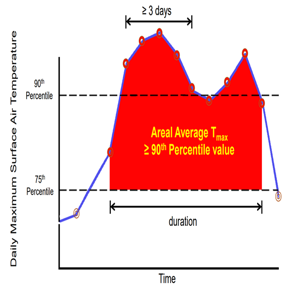
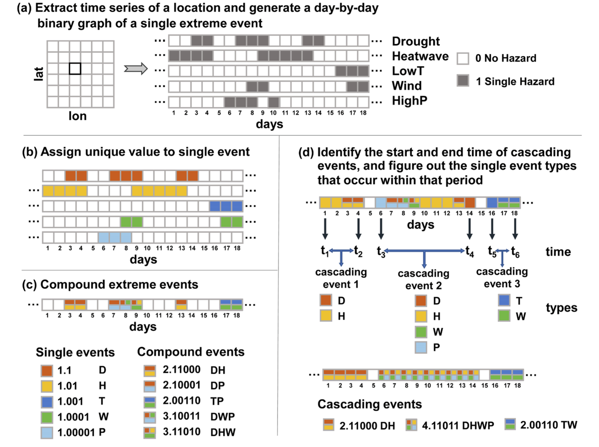
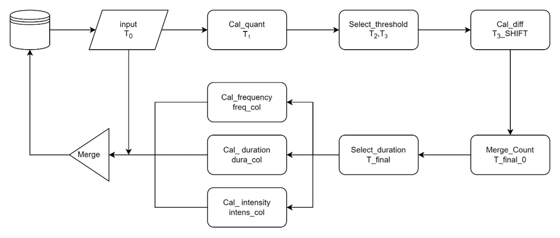

# Urban Climate Explorer
Currently, we provide some scrpits to calculate the cliamte extremes. Here are some explanatios of the scripts.
## 1 极端气候
- **极端气候定义**
    
    在时间序列中，出现连续三天大于等于气温阈值时记为一个极端事件。

高温热浪定义

- **极端复合事件** 
  （暂未实现）
  参考ppt (Yu et. al., Environment International 169 (2022)
)
  

极端复合时间计算

- **极端气候指标**
  - intensity：强度。对应气候指标的均值（例如，发生高温热浪时的平均温度）
  - duration：持续时间。发生极端事件的持续时间
    - total duration：对应计算时间段的每个极端事件持续时间的总和。
    - single event duration：单个极端事件持续时间的均值。

## 2 sql scripts
sql文件夹包含了多个sql脚本，这些sql是用于计算极端气候的。请注意，此sql脚本采用的百分位数阈值来计算极端气候。具体计算原理如下：

极端事件计算流程图

### 1.1 SQL脚本思路
1. T0从cesm数据集中取出符合条件的气候指标（cliamte_index）、经度、纬度和时间
2. T1, 利用percentile_approx计算分位数，quant
3. T2, 将大于quant的气候指标记为1，否则为0，HW
4. T3，去除HW=0的数据，并新建行号row_number用于之后作索引进行差分。
5. T3_SHIFT，对相邻两行的时间作差分（diff），若满足：相差一天且经纬度一致（同一地区），则diff记为0，否则为1
6. T_fina_0，计算diff的累积和（cumsum），得到 group_id（若diff=0则同一组）
7. T_final，对group_id 进行分类计数，得到热浪持续时间duration，此时获得的数据为single_duration，也即单一事件的持续时间。
8. freq_col，计算同一地区不重复group_id的个数作为热浪频率feq
9. dura_col，对lat、lon、group_id进行分组并获取duration均值avg_d（此步目的主要是使得去除组内duration的重复，avg相当于去重），之后对avg_d根据lat、lon进行开窗后求和，得到每个地区，总的热浪持续时间total_dur
10. intens_col，对T_final的climate_index进行lat、lon分组求和得到mean_tmp，记为强度
11. Metrics_col，从freq_col，dura_col，intens_col获取频率、平均指标、持续时间、经纬度
12. Result，从Metrics_col,T_final两个表中取出需要的指标
13. 将result输出到表中

### 1.2 ODPS分位数与Pandas分位数的差异

#### 1.2.1 Odps计算分位数的函数
[PERCENTILE](https://help.aliyun.com/zh/maxcompute/user-guide/percentile?spm=a2c4g.11186623.0.0.5f4e4aeeL4aGgt)：计算精确百分位数，适用于小数据量。先对指定列升序排列，然后取精确的第p位百分数。p必须在0和1之间。colname：必填。值为BIGINT类型的列。

[PERCENTILE_APPROX](https://help.aliyun.com/zh/maxcompute/user-guide/percentile-approx?spm=a2c4g.11186623.0.0.5f4e4aeeL4aGgt)：计算近似百分位数，适用于大数据量。先对指定列升序排列，然后取第p位百分数对应的值。colname：必填。值为DOUBLE类型的列。
两种方法均采用线性插值的方法，具体如下：

    从编号0开始计算，例如某列数据为100、200、300，列数据的编号顺序为0、1、2，计算该列的0.3百分位点，percentile结果是2×0.3=0.6，即值位于编号0和1之间，结果为100+(200-100)×0.6=160。

#### 1.2.1 pandas/numpy计算分位数的函数
pandas计算分位数函数：[pandas.DataFrame.quantile](https://pandas.pydata.org/pandas-docs/stable/reference/api/pandas.DataFrame.quantile.html)

计算方法说明：默认使用线性插值求分位数。

    Dataframe的线性插值计算方法与ODPS提供的函数不一致，pandas是从编号0开始进行计算，例如某列数据为100、200、300，列数据的编号顺序为0、1、2，计算该列的0.6百分位点，quantile结果是2×0.6=1.2，即值位于编号1和2之间，结果为200+(300-200)×0.2=220

## 3 util/sql2odps.py
此py文件包含三大部分：
### 3.1 本地使用pandas实现极端气候极端
Ref (Zheng et. al., Nature Communications 12 (2021) 
)
- load_df(file_path): 读取本地数据
  - 参数:csv文件路径
  - 输出:pandas dataframe
- get_mean(df_raw, model_type)：获取均值

### 3.2 ODPS 函数
- show_instance_statues(o,need_stop = False)：显示当前ODPS的instance的状态
  - 参数
  1. o:ODPS对象
  2. need_stop:是否需要停止所有的instance,默认为False

- read_sql(path,input_stream, output_filename='output.txt')：使用文本编辑器的方法,读取sql脚本,并将其中的超参数进行替换,转换成为pyodps合适的输入
    - path: sql脚本的路径
    - input_stream: sql脚本中的参数,字典形式
    - output_filename: 输出的sql脚本的路径,默认为'output.txt',用- 调试代码查看结果
- get_config(json_path)：读取json文件,获取用户输入的参数
  - 参数: json_path:json文件的路径
  - 输出:用户输入的参数,字典形式

- odps_exec(json_path = 'config.json',loop_order = ['member_id','percentile','var'],need_answer = True,need_loop = True,need_modify = False,modify_dict = {},merge_mode = False)

    执行ODPS的sql脚本,运行时,首先会读取json文件,获取用户输入的参数并显示,让用户检查是否正确,如果正确,则输入Y,执行sql脚本,如果不正确,用户需要输入"N",则会让用户修改参数,修改完成后,按下任意键继续,会重新询问用户是否正确,直到用户输入Y为止,如果用户输入Q,则会退出程序。

    - 参数:
    - json_path:json文件的路径,默认为'config.json'
    - loop_order:需要循环执行的参数,默认为['member_id'- 'percentile','var'],若有些数据集不需要循环member_id,则可- 将member_id,则可以修改为['percentile','var']
    - need_answer:是否需要用户确认输入的参数,默认为True,如果- False,则不会询问用户是否正确,直接执行sql脚本
    - need_loop:是否需要循环执行sql脚本,默认为True,如果为False,- 只执行一次sql脚本
    - need_modify:是否需要修改输入的参数,默认为False,如果为True,- 会读取modify_dict,并将其中的参数替换到json文件中,然后执行sq- 脚本
    - modify_dict:需要修改的参数,字典形式,默认为{}
    - merge_mode:是否需要合并结果,默认为False,如果为True,则会启- 合并表的模式,读取06-15年quant,作为后续计算的quantile_avail
